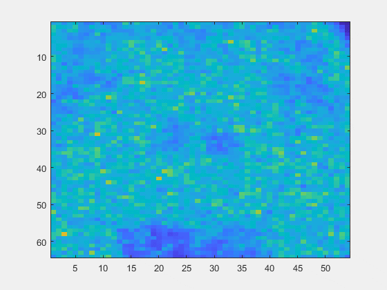
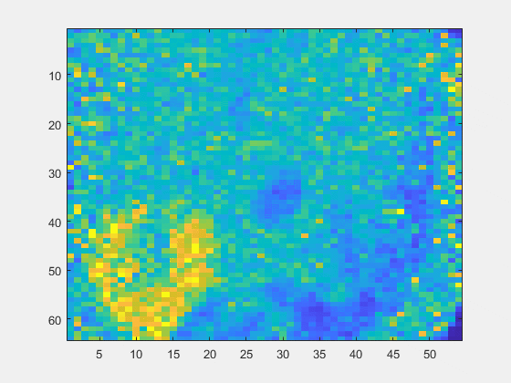
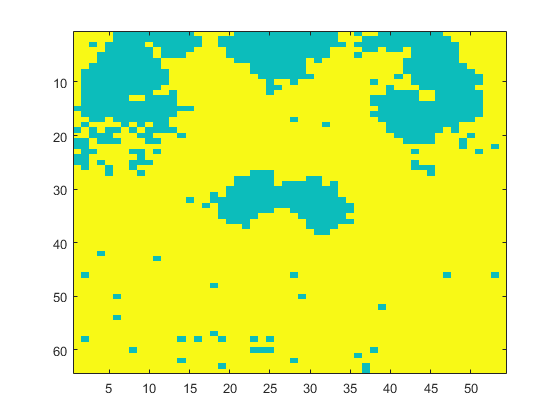
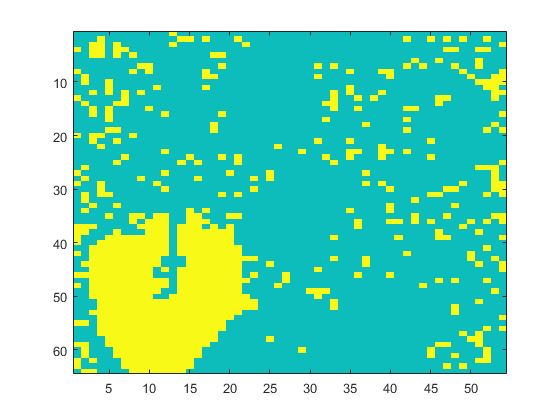

# Segmentation d’images TEP par classification spectrale
L’objectif de ce TP est de segmenter des images Tomographie par Emission de Positons (TEP) via une
méthode de classification spectrale.

Images de coupes transverse et sagittale simulées à un instant t de taille 64 × 54 :

## Données
### Transverse

### Sagittale

## Classification
### Transverse

### Sagittale
